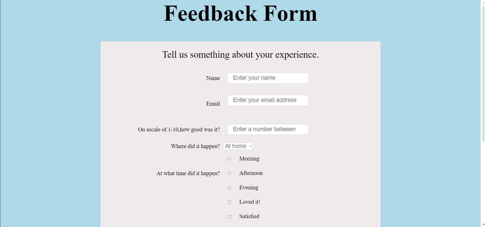

# Welcome 🖐 to the Feedback Form.
It is a simple and resonsive feedback Form.

## Default View



## 💻Tech Stack
<br>


<br>

### How to use:

---

- Download or clone the repository

```
git clone https://github.com/neonite2217/Web_DL_Projects.git
```

- Go to the directory
- Run the index.html file
- Use the form.

<br>

## Happy Coding!