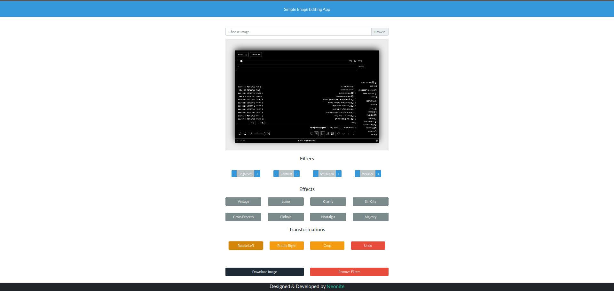

[](https://github.com/neonite2217)
[](https://github.com/neonite2217?tab=repositories)

<h1>Image Filter App</h1>

<p>An Simple Image Filter App written in HTML, CSS, JavaScript and CamanJS .</p>

## Overview

<p>A Image Filter App helps to apply filters, rotate and crop to your image as well modify different image characteristics like brightness etc. </p>

## ⚙️ Languages or Frameworks Used
<ul>
  <li>HTML5</li>
  <li>CSS3</li>
  <li>JavaScript</li>
  <li>CamanJS</li>
</ul>

### Installation
Running this game is easy.
Clone the Repository

```sh
git clone https://github.com/neonite2217/Web_DL_Projects.git
```

Navigate to the project directory and run `index.html` file in your web browser
- Upload The Image
- Apply filters to it
- Download the Modifed Image by clicking On Download Button.
- And here you have the modified image

## 📺 Demo
<p align="center">



## 🤖 Author
[Biswaketan](https://github.com/neonite2217/)

