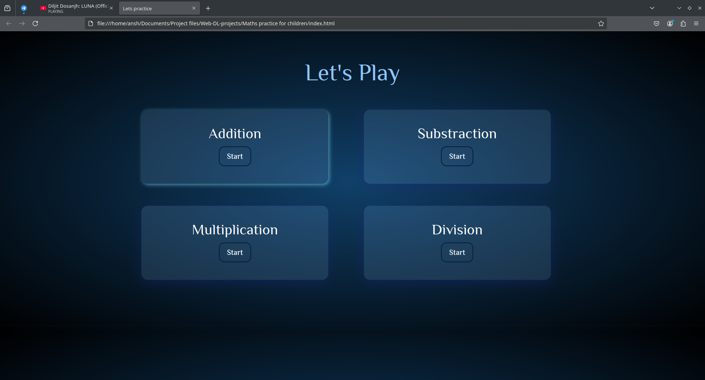

[](https://github.com/neonite2217)
[](https://github.com/neonite2217?tab=repositories)

## 🛠️ Description

This webapp is basically for kids to practice addition, substraction, multiplication and division.

## ⚙️ Languages or Frameworks Used
<ul>
    <li>HTML5</li>
    <li>CSS3</li>
    <li>JavaScript</li>
</ul>

### To get the game on your local machine:

Running this game is easy.

- Clone the repository

```sh
git clone https://github.com/neonite2217/Web_DL_Projects.git
```

- Go to the directory
- Run the index.html file
- Check your maths solving capacity.


### How to use 
1. Select the option you want to practice.
1. Calculate and write your ans in the box and click check answer.
2. Alert will be given if the ans is write or wrong .
3. Click ok to continue the quiz.

## 📺 Demo
<p align="center">



## 🤖 Author
[Biswaketan](https://github.com/neonite2217/)

