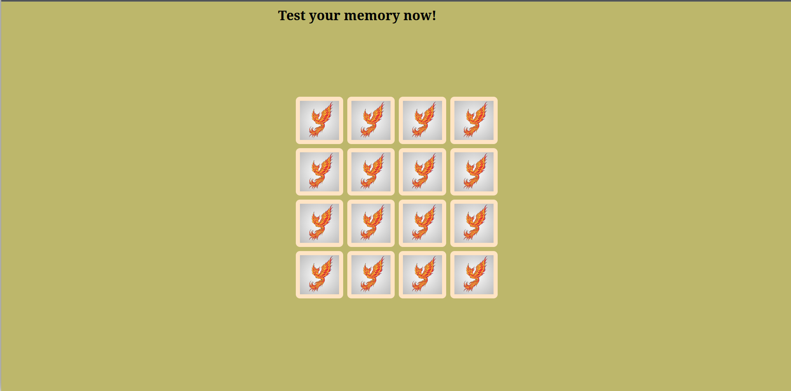

[](https://github.com/neonite2217)
[](https://github.com/neonite2217?tab=repositories)

# Memory Card Game
A basic memory game in which the trick is to remember which cards are where.

## ⚙️ Languages or Frameworks Used
<ul>
  <li>HTML5</li>
  <li>CSS3</li>
  <li>JavaScript</li>
</ul>


### Installation
Running this game is easy.
Clone the Repository

```sh
git clone https://github.com/neonite2217/Web_DL_Projects.git
```

Navigate to the project directory and run `index.html` file in your web browser
Good to start playing.

## 📺 Demo
<p align="center">



## 🤖 Author
[Biswaketan](https://github.com/neonite2217/)
