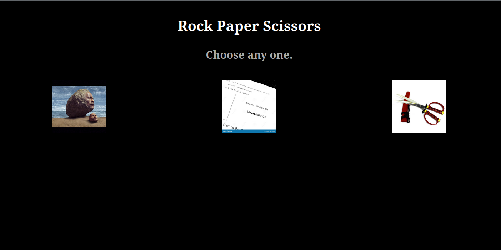

[](https://github.com/neonite2217)
[](https://github.com/neonite2217?tab=repositories)

# Rock-Paper-Scissor Game 🗿 📜 ✂️

## 🛠️ Description
*This Rock-Paper-Scissor Game allows you to play rock paper scissor with the computer. Have fun playing :)*

## ⚙️ Languages or Frameworks Used

• HTML

• CSS

• JAVASCRIPT


### Steps to use: 

Clone the Repository

```sh
git clone https://github.com/neonite2217/Web_DL_Projects.git
```

- Navigate to the directory
- Run the index.html file
- Start Playing!!!

## 📺 Demo
<p align="center">


## 🤖 Author
[Biswaketan](https://github.com/neonite2217/)
