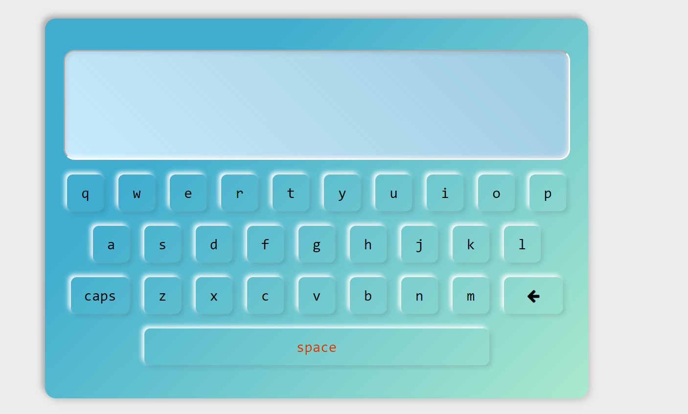

<h1>JavaScript Virtual Keyboard</h1>

<p>Keyboard on the screen with all the features and a display</p>

### Use of the Project:

<p>User clicks on the virtual keys and see what is being typed on the diplay</p>

<h3>Used Technologies</h3>
<ul>
  <li>HTML5</li>
  <li>CSS3</li>
  <li>JavaScript</li>
</ul>

#### Steps to Use:

---

- Download or clone the repository

```
git clone https://github.com/neonite2217/Web_DL_Projects.git
```

- Go to the directory
- Run the index.html file
- Start Typing!

<h3> Screenshots </h3>

<br>
