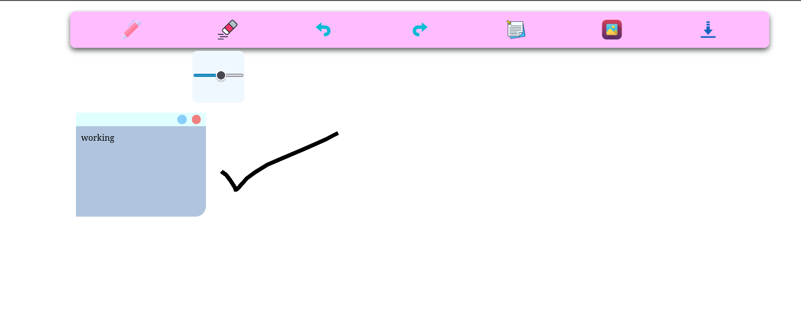

[](https://github.com/neonite2217)
[](https://github.com/neonite2217?tab=repositories)

# Digital White Board

## About the Project
It is a simple digital white board built using HTML, CSS and Javascript. It has the following features :

1. Pen with different sizes & colors
2. Eraser with different sizes
3. Undo
4. Redo
5. Sticky Notes
6. Image Upload
7. Download


## ⚙️ Languages or Frameworks Used


## How to use the Project

• Clone the repository

```sh
git clone https://github.com/neonite2217/Web_DL_Projects.git
```


• Navigate to the project directory and run `index.html` file in your web browser
• Start playing with board, explore different features

## 📺 Demo
<p align="center">



## 🤖 Author
[Biswaketan](https://github.com/neonite2217/)
