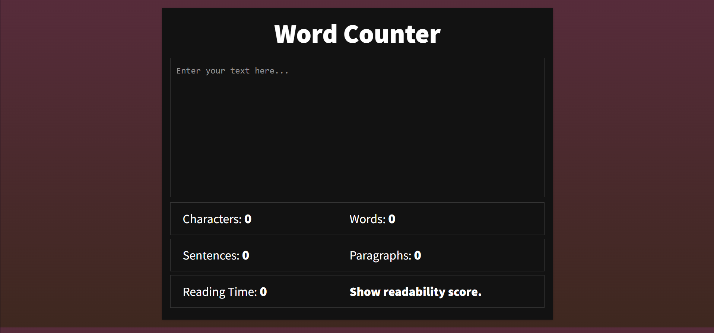

<h1>Word counter </h1>

<p>Word counter App written in HTML, CSS, and JavaScript .</p>

### Use of the Project:

<p>Word counter makes counting words easier and faster. Word counter are used to everyone in daily life for bloggers and writers.
<h3>Used Technologies</h3>
<ul>
  <li>HTML5</li>
  <li>CSS3</li>
  <li>JavaScript</li>
</ul>

#### Steps to Use:

---

- Download or clone the repository

```
git clone https://github.com/neonite2217/Web_DL_Projects.git
```

- Navigate to the directory
- Run the word.html file
- Start counting Words!!

